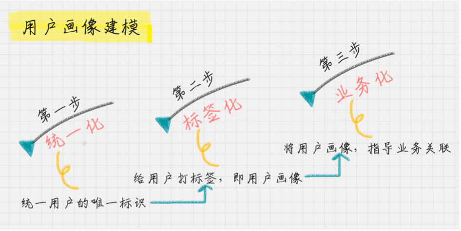
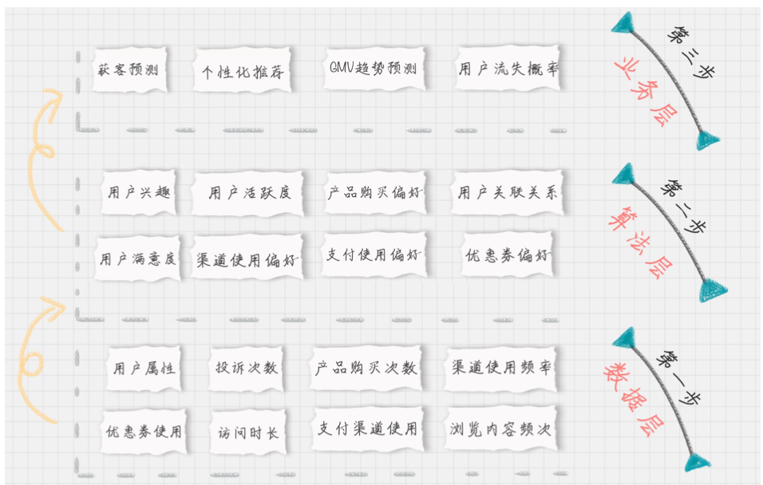

# 07-用户画像: 标签化就是数据的抽象能力

**精细化运营**

## 用户画像准则

首先就是将自己的企业用户画像做个白描。知道用户 “都是谁” 、“从哪来”、 “要去哪”

### 首先为什么要设计维一标识

**用户唯一标识是整个用户画像的核心**

以一个app 为例，它把“从用户开始使用app到下单到售后整个所有的用户行为” 进行串联，这样就可以更好的去跟踪和分析一个用户的特征

> 唯一标识选择： 用户名，注册手机号、联系人手机号、邮箱、设备号、CookieId等

### 其次，给用户打标签

为了保证用户画像的全面性

**用户消费行为分析**

1. 用户标签：性别、年龄、地域、收入、学历、职业等
2. 消费标签：消费习惯、购买意向、是否对促销敏感
3. 行为标签：时间段、频次、时长、访问路径
4. 内容分析：对用户平时浏览的内容，尤其是停留时间长，浏览次数多的内容进行分析，分析出用户对哪些内容感兴趣，比如，金融、娱乐、教育、体育、时尚、科技等。

我们可以从用户生命周期的三个阶段来划分业务价值，包括：

1. 获客： 如何进行拉新，通过更精准的营销获取客户
2. 粘客：个性化推荐，搜索排序，场景运营等
3. 留客：流失率预测，分析关键节点降低流失率。

按照数据流处理的阶段来划分用户画像建模的过程， 可以分为：

1. 数据层：用户消费行为里的标签，我们可以打上“事实标签”， 作为数据客观的记录
2. 算法层：透过这些行为算出的用户建模。我们可以打上“模型标签”，作为用户画像的分类标识
3. 业务层：指的是获客，粘客、留客的手段。我们可以打上“预测标签”，作为业务关联的结果

