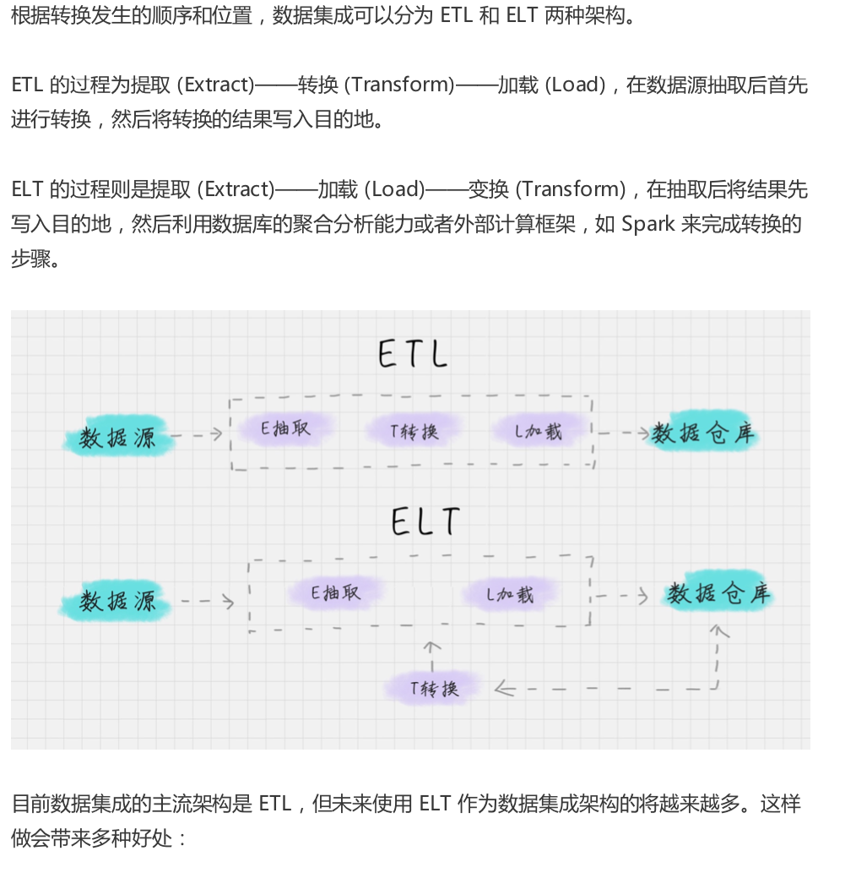
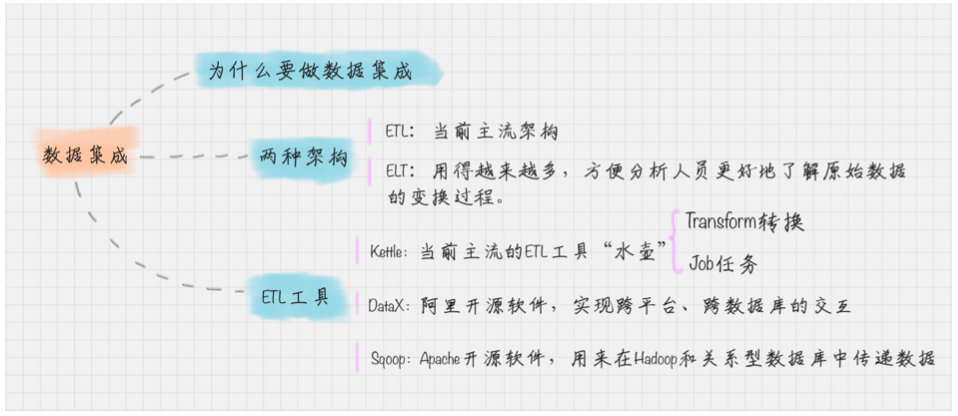

# 12-数据集成: 这些大号一共20亿粉丝?

##数据集成的两种架构: ELT 和 ETL

ETL (Extract、Transform、Load)

数据抽取，转换，加载

## ETL 工具有哪些

典型的ETL 工具有

* 商业软件：Infomatica PowerCenter、 IBM InfoSphere DataStage、Oracle Data Integrator、 Microsoft SQL Server Integration Services等
* 开源软件: Kettle、Talend、Apatar、Scriptella、 DataX、Sqoop等

