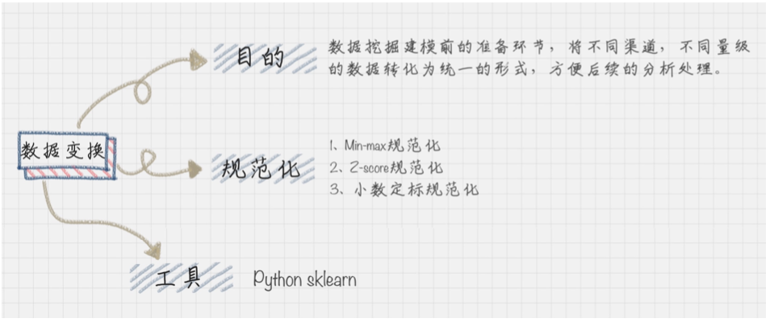

# 13-数据变换: 考试成绩要求正态分布合理么?


## 常见变换方法


### 数据规范的几种方法

1. Min-max 规范化

   新数值 = (原数值 - 极小值)/(极大值- 极小值)

2. Z-Score 规范化

   新数值 = (原数值 - 均值 )/ 标准差

3. 小数定标规范化

   通过移动小数点的位置来进行规范化。移动多少位取决于属性A 中的最大绝对值

   比如 A 取值范围 -999 到 88。那么最大绝对值999，小数点移动3位, 即 新数值 = 原数值 / 1000。那么 A的取值范围为 -0.999 到0.088

### Python 的 SciKit-Learn 库的使用

```python
# coding: utf-8
from sklearn import preprocessing
import numpy as np

# 初始化数据

x = np.array([[0., -3, 1.],
            [3., 1., 2.],
            [0., 1., -1.]])

# 1. Min-max 规范化
# 将数据惊喜[0,1]规范化

min_max_scaler = preprocessing.MinMaxScaler()
minmax_x = min_max_scaler.fit_transform(x)
minmax_x
# 2. Z-Score 规范化
scaled_x = preprocessing.scale(x)
scaled_x
# 3. 小数定标规范化
j = np.ceil(np.log10(np.max(abs(x))))
scaled_x2= x/(10**j)
scaled_x2
```





