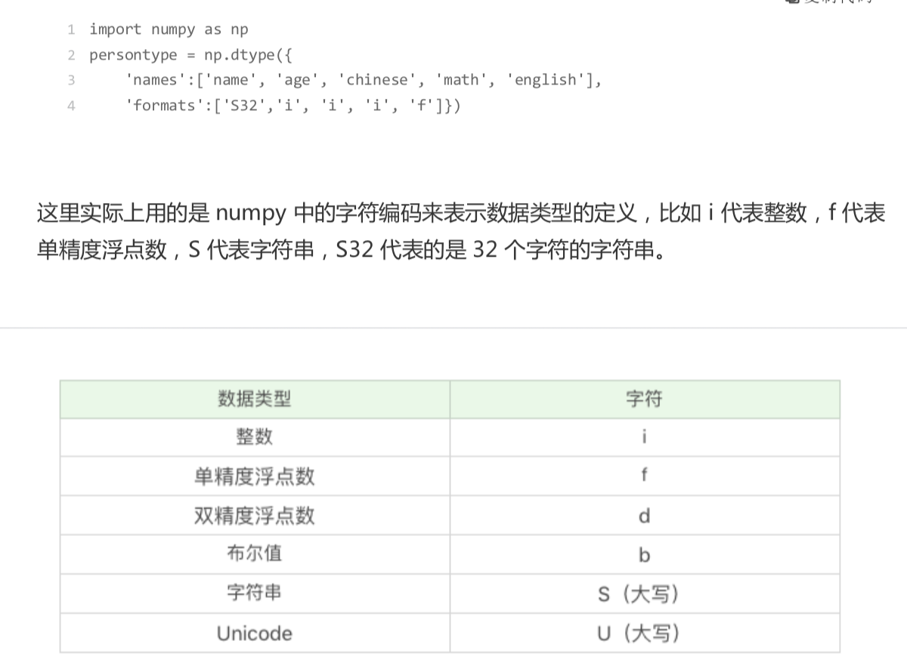

# 16-数据分析基础篇答疑

## NumPy 相关

* 答疑1：如何理解 NumPy 中的 axis 的使用

  axis = 0 ,代表跨行(实际按上就是按列)

  axis = 1，代表跨列(实际是按行)

  axis 默认 -1 最后一个轴排序

  axis = None 代表以扁平化方式进行排序

  ```python
  a = np.array([[4,3,2],[2,4,1]])
  print(np.sort(a))
  print(np.sort(a, axis=None))
  print(np.sort(a, axis=0))
  print(np.sort(a, axis=1))
  ```

* 答疑2: 定义结构数组中的 S32 代表什么意思

  

  