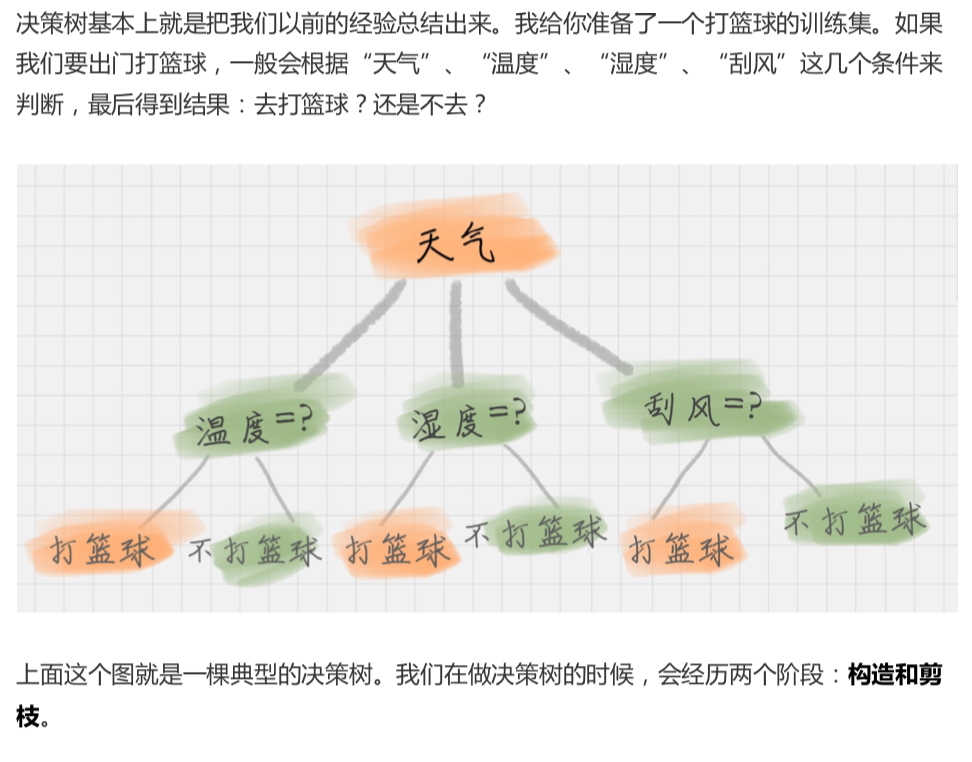
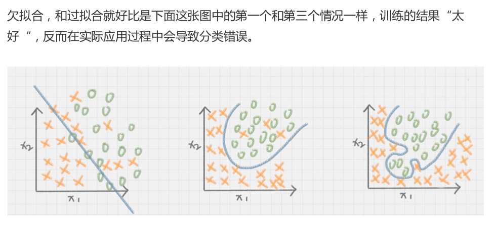
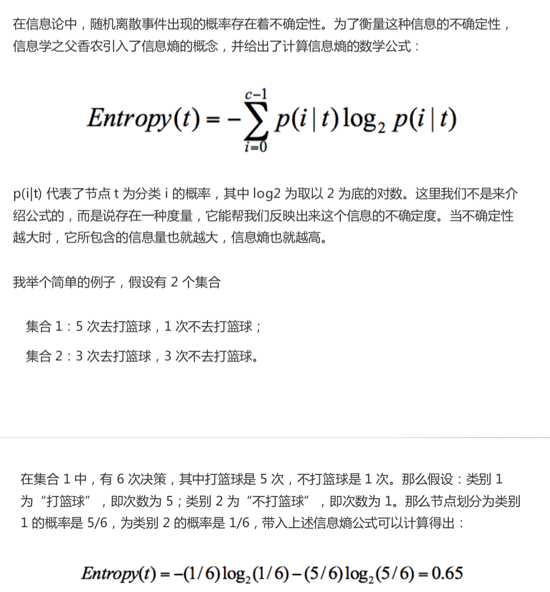
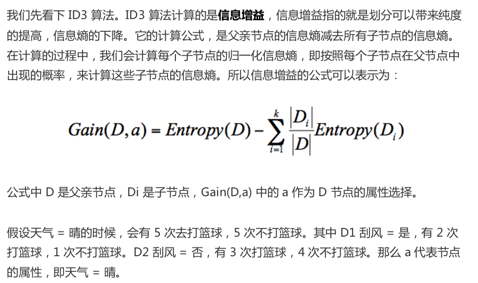
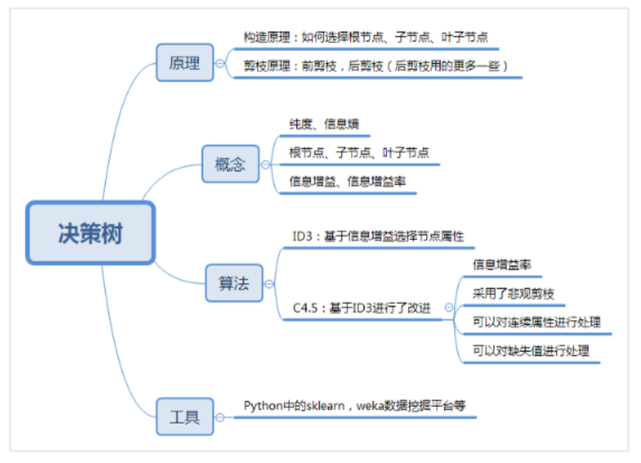

# 17-决策树(上): 要不要去打篮球？决策树来告诉你

## 决策树的工作原理

### 构造

构造的过程就是选择什么属性作为节点的过程

三种节点

* 根节点
* 内部节点
* 叶节点

### 剪枝

剪枝就是给决策树瘦身

目标： 不需要太多的判断，同样可以得到不错的结果。

防止"过拟合"

剪枝的方法

1. 预剪枝,在决策树构造时进行剪枝
2. 后剪枝在生成决策树之后再进行剪枝

## 指标

* 纯度 让目标变量的分歧最小
* 信息熵  表示了信息的不确定度

## 算法

* ID3

  计算信息增益, 信息增益是指划分可以带来纯度的提高，信息熵的下降。

  

* C4.5

  对 ID3 的改进

  1. 采用信息增益旅
  2. 采用悲观剪枝
  3. 离散化处理连续属性
  4. 处理缺失值

* Cart 

