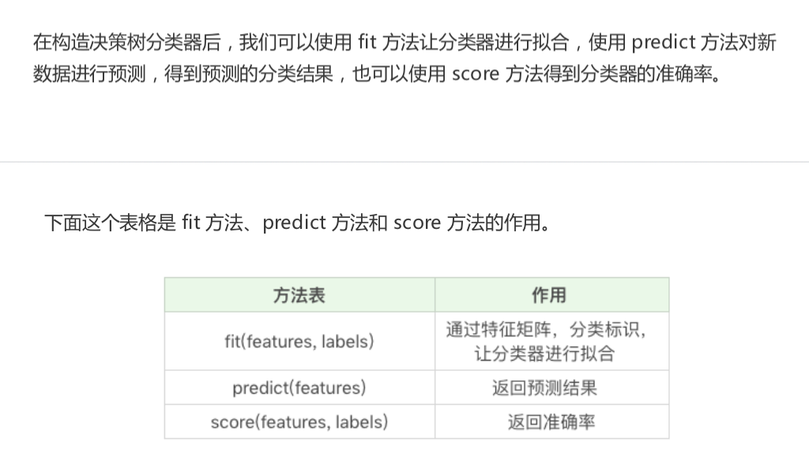
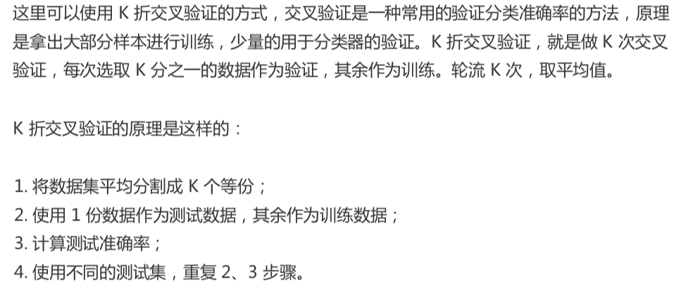

# 19-决策树(下):泰坦尼克乘客生存预测

## sklearn 中的决策树

**DecisionTreeClassifer**

最新的是 `DecisionTreeRegressor`

```python
dlf = DecisionTreeClassifer(criterion='entropy')
```

ctiterion 对应

entropy: 基于信息熵， ID3 算法，与 C4.5 相差不大

gini: 默认参数，基于基尼系数 CART 算法





## Titanic 乘客生存预测

数据集

​	train.csv 是训练数据集， 包含特征和存活与否的标签

​	test.csv 测试数据集, 只包含特征信息


### 生存预测的关键流程


* 模块1: 数据探索

  * info() 了解数据表的基本情况： 行数，列数，每列数据类型，数据完整度
  * describe() 了解数据表的基本统计情况：总数、平均值、标准差、最小值、最大值等
  * describe(inclue=['O']) 查看字符串(非数字)的整体情况
  * head 查看前几行
  * tail 查看后几行

  


```python
import pandas as pd
# 数据加载

train_data = pd.read_csv('./datasets/titanic/train.csv')
test_data = pd.read_csv('./datasets/titanic/test.csv')

# 1. 数据探索
print(train_data.info())
print('-'*30)
print(train_data.describe())
print('-'*30)
print(train_data.describe(include=['O']))
print('-'*30)
print(train_data.head())
print('-'*30)
print(train_data.tail())

# 2. 数据清洗
# 填充 Age nan 值
train_data['Age'].fillna(train_data['Age'].mean(), inplace=True)
test_data['Age'].fillna(test_data['Age'].mean(), inplace=True)
# 填充 Fare nan 值
train_data['Fare'].fillna(train_data['Fare'].mean(), inplace=True)
test_data['Fare'].fillna(test_data['Fare'].mean(), inplace=True)

# Cabin 大量缺失值，无法补齐


# Embarked 登陆港口
print(train_data['Embarked'].value_counts())

# 用最多的值，填充 Embarked
train_data['Embarked'].fillna('S',inplace=True)
test_data['Embarked'].fillna('S',inplace=True)

# 3. 特征选择
features = ['Pclass', 'Sex', 'Age', 'SibSp', 'Parch', 'Fare', 'Embarked']
train_features = train_data[features]
train_labels = train_data['Survived']
test_features = test_data[features]

print(train_features.head())
print(test_features.head())

# 字符串列转换成数值
from sklearn.feature_extraction import DictVectorizer
dvec = DictVectorizer(sparse=False)
train_features= dvec.fit_transform(train_features.to_dict(orient='record'))
print(dvec.feature_names_)

# 4. 决策树模型
from sklearn.tree  import DecisionTreeClassifier
# 构造 ID3 决策树
clf = DecisionTreeClassifier(criterion='entropy')
# 决策树训练
clf.fit(train_features, train_labels)


# 5. 模型预测与评估
test_features = dvec.transform(test_features.to_dict(orient='record'))
# 决策树预测
pred_labels = clf.predict(test_features)

# 得到决策树准确率
acc_decision_tree = round(clf.score(train_features, train_labels),6)
print(u'score 准确率为 %4lf' % acc_decision_tree)

```


但是这个是训练集的准确率，因为没有测试集的预测结果验证作对比。


这里采用 K 折交叉验证的方式




sklearn 中 `modle_selection` 模型选择中提供了 `cross_val_score` 函数。

参数 cv 代表对原始数划分成多少分，也就是 我们的 K 值

```python
# k 折交叉验证
import numpy as np
from sklearn.model_selection import cross_val_score

# 统计决策树准确率
print(u'cross_val_score 准确率为 %4lf' % np.mean(cross_val_score(clf,train_features,train_labels, cv=10)))
```


#### 决策树可视化

`Graphviz` 可视化工具可视化

下载

`htts://github.com/cystanford/Titanic_Data`


## 总结


