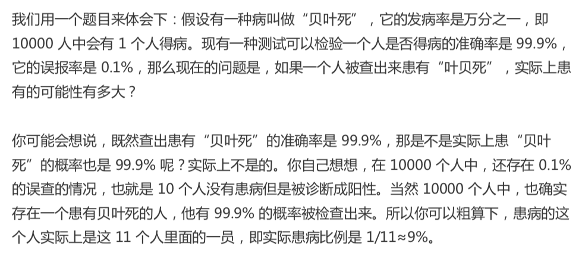
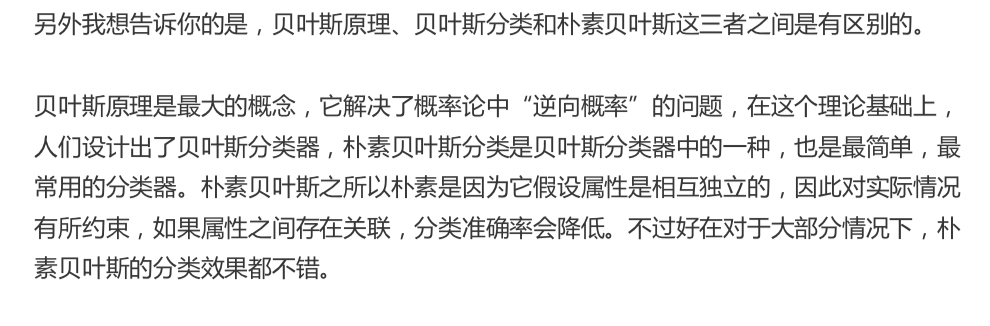
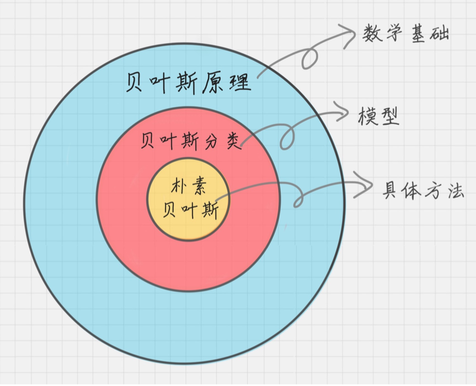
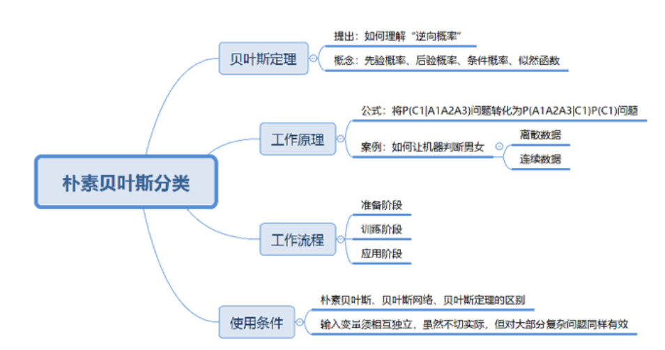

# 20-朴素贝叶斯分类（上）：如何让机器判断男女？

### 贝叶斯原理

贝叶斯原理

贝叶斯威了解决一个叫“逆向概率”问题写了一片文章，尝试解答在没有太多可靠证据的情况下，怎样做出更符合数学逻辑的推测。

什么是 “逆向概率”呢？

所谓“逆向概率” 是相对 “正向概率”而言。 正向概率就是袋中摸球

逆向概率，提出了一个问题： 如果我们事先不知道，袋子里的黑球和白球的比例，而是通过我们摸出来的球的颜色，能判断出袋子里的黑白球的比例。

**几个概念**

* 先验概率

  通过经验来判断事情发生的概率，比如 南方的梅雨季是 6～7月

* 后验概率

  后验概率是结果发生之后，推测原因的概率。比如，某人查出来患了“贝叶死”， 那么可能患病的原因可能是A、B、C。 是因为 A的概率就是后验概率。

* 条件概率

  事件A 在另外一个事件B已经发生条件下的发生概率， 表示为 P(A|B）。读作在 B 发生的条件下A发生的概率

* 似然函数

  可以把概率模型的训练过程理解为求参数估计的过程。

  

### 朴素贝叶斯

它是一种简单但极为强大的预测建模算法

它假设每个输入变量是独立的

朴素贝叶斯由两种类型的概率组成

1. 每个类别的概率 P(Cj)
2. 每个属性的条件概率P(Ai|Cj)

贝叶斯原理、贝叶斯分类、朴素贝叶斯

### 朴素贝叶斯分类工作原理

日常生活中，看到一个陌生人，要做的第一件事情就是判断TA的性别，判断性别的过程就是一个分类的过程。根据以往的经验，我们通常会从身高、体重、鞋码、头发长短、服饰、声音等角度进行判断，“经验”就是一个训练好的关于性别判断的模型， 其训练数据是日常中遇到各式各样的人，以及这些人的实际性别数据。

#### 离散数据案例

#### 连续数据案例

#### 朴素贝叶斯分类起工作流程

朴素贝叶斯分类常用于 文本分类，尤其是对英语等语言来说，它常用于 垃圾文本过滤，情感预测，推荐系统。

* 第一阶段：准备阶段

  需要确定特征属性， 唯一需要人工完成的步骤

* 第二阶段：训练阶段

  输入是特征属性和训练样本 生成分类器

* 第三阶段：应用阶段

  对新数据进行分析，输入是分类器和新数据，输出是新数据的分类结果

### 总结

