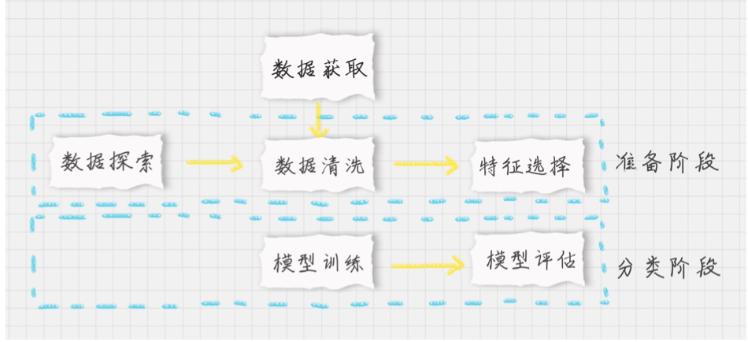
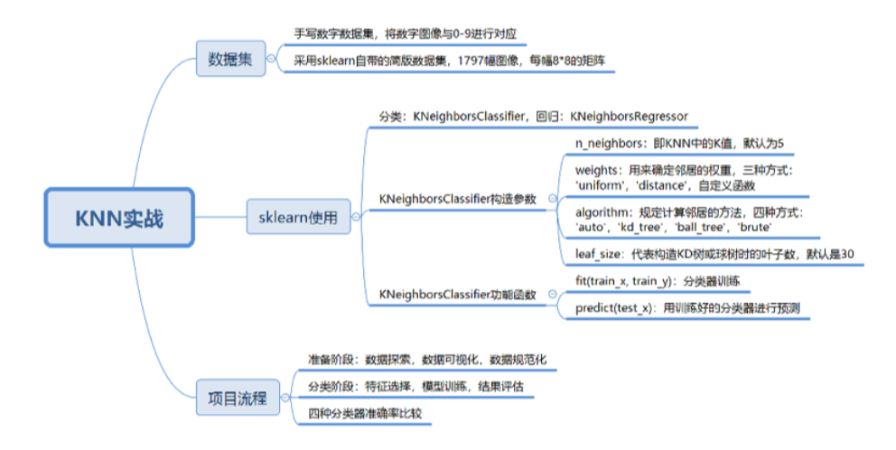

# 25-KNN（下）：如何对手写数字进行识别？

### 如何在 sklearn 中使用 KNN

`分类: from sklearn.neighbors import KNeighborsClassifier`

`回归: from sklearn.neighbors import KNeighborsRegressor`


`KNeighborsClassifier(n_neighbors=5, weights='uniform', algorithm='auto',leaf_size=30)`

参数:

1. n_neighbors 即 KNN 中的 K值，代表的是邻居的数量。默认是5，K 值比较小，会过拟合， K 值较大，无法将未知物体分类出来

2. weights: 是用来确定邻居的权重

   1. uniform 代表所有邻居权重相同
   2. distance 代表权重是距离的倒数，即成反比
   3. algorithm 用来规定计算邻居的方法，auto ，默认， kd_tree KD 树， ball_tree 球树， brute，暴力搜索。
   4. leaf_size 代表构造 KD 树或球树的叶子树，默认是 30

   

### 如何用 KNN 对手写数字进行识别分类

手写数据集 MNIST


KNN 分类流程




1. 数据加载： 我们可以直接从 sklearn 中加载自带的手写字数据集
2. 准备阶段：对数据进行初步了解，比如，样本个数，图像，识别结果
3. 分类阶段： 通过训练得到分类器，用测试集进行准确率进行计算

```python
from sklearn.model_selection import train_test_split
from sklearn import preprocessing
from sklearn.metrics import accuracy_score
from sklearn.datasets import load_digits
from sklearn.neighbors import KNeighborsClassifier
from sklearn.svm import SVC
from sklearn.naive_bayes import MultinomialNB
from sklearn.tree import DecisionTreeClassifier
import matplotlib.pyplot as plt
import warnings

warnings.filterwarnings('ignore')

%matplotlib inline

# 读取数据
digits = load_digits()
data = digits.data
print(data.shape)
print(digits.images[0])
print(digits.target[0])
plt.gray()
plt.imshow(digits.images[0])
plt.show()

# 数据划分
train_X, test_X = train_test_split(data, test_size=0.25, random_state=33)
train_y, test_y = train_test_split(digits.target, test_size=0.25, random_state=33)
# 数据标准化
ss = preprocessing.StandardScaler()
train_ss_X = ss.fit_transform(train_X)
test_ss_X = ss.fit_transform(test_X)

# KNN分类器
knn = KNeighborsClassifier()
knn.fit(train_ss_X, train_y)
predict = knn.predict(test_ss_X)
print('KNN准确率：%.4lf' % accuracy_score(predict, test_y))

# SVM分类器
svm = SVC()
svm.fit(train_ss_X, train_y)
predict = svm.predict(test_ss_X)
print('SVM准确率：%.4lf' % accuracy_score(predict, test_y))

# 朴素贝叶斯
# 特征不能为负值，用Min-Max规范化
mm = preprocessing.MinMaxScaler()
train_mm_X = mm.fit_transform(train_X)
test_mm_X = mm.fit_transform(test_X)
nb = MultinomialNB()
nb.fit(train_mm_X, train_y)
predict = nb.predict(test_mm_X)
print('朴素贝叶斯准确率：%.4lf' % accuracy_score(predict, test_y))

# 决策树
dtc = DecisionTreeClassifier()
dtc.fit(train_ss_X, train_y)
predict = dtc.predict(test_ss_X)
print('决策树准确率：%.4lf' % accuracy_score(predict, test_y))


```





