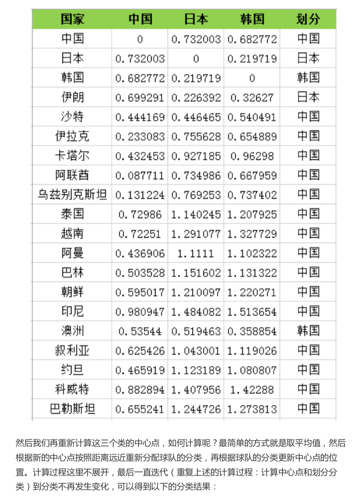

# 26-K-Means（上）：如何给20支亚洲球队做聚类？


K-Means 是一种非监督学习，解决的是聚类问题。

K 代表 K 类， Means 代表的是中心

> 可以理解这个算法的本质是确定 K 类的中心点，当你找到了这些中心点，也就完成了聚类


思考三个问题:

1. 如何确定 K 类的中心点
2. 如何将其他点划分到 K 类中
3. 如何区分 K-Means 与 KNN


### K-Means 的工作原理

1. 选取 K 个点作为初始的类中心点，这些点一般都是从数据集中随机抽取的。
2. 将每个点分配到最近的类中心点，这样就形成了 K 个类，然后重新计算每个类的中心点
3. 重复第二步，知道类不发生变化，或者也可以设置最大叠戴次数，这样即使类中心点发生变化，但是只要达到最大迭代次数就会结束。


### 如何给亚洲球队做聚类





### 如何使用 sklearn 中的 K-Means 算法

sklearn 导包

`from sklearn.cluster import KMeans`

构造函数

`KMeans(n_clusters=8, int='K-means++', n_init=10,max_iter=300,tol=0.0001)`

* n_clusters: 即 K 值
* max_iter: 最大迭代次数
* n_int: 初始化中心点的运算次数，默认 10
* Init: 初始值的选择方式, 默认 "k-means++"
* algorithm: K-means 的实现算法. "auto", "full", "elkan" 三种。。


```python

```


### 总结


