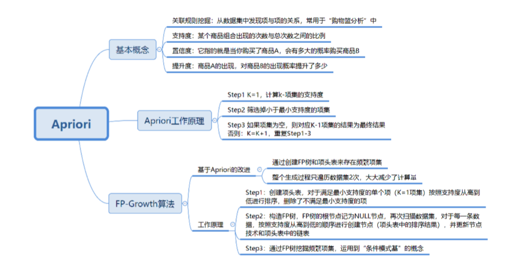

# 30-关联规则挖掘（上）如何用Apriori发现用户购物规则？

知识点:

1. 搞懂关联规则中的几个重要概念： 支持度、置信度、提升度；
2. Apriori 算法的工作原理
3. 在实际工作中，我们该如何进行管理规则挖掘

**搞懂关联规则中的几个概念**

* 支持度

  订单商品组合出现的次数与总次数之间的比例

* 置信度

  指的是购买了商品A，会有多大的概率购买商品B

* 提升度

  推荐商品时，我们重点考虑提升度。 提升度代表“商品A的出现，对商品B出现率的提升”

  提升度(A -> B) = 置信度(A -> B) / 支持度(B)

  有三种可能:

  	1. 	提升度(A -> B)  > 1: 代表有提升
   	2. 	提升度(A -> B)  = 1: 代表没有提升，也没有下降
   	3. 	提升度(A -> B)  < 1: 代表有下降

### Apriori 工作原理

Apriori 算法其实就是查找频繁项集( frequent itemset) 的过程， 所以首先我们需要定义什么是频繁项集

频繁项集就是支持度大雨等于最小支持度(Min support) 阈值的项集

1. K = 1, 计算K 项集的支持度
2. 筛选掉笑语最小支持度的项集
3. 如果项集为空，则对应K-1 项集结果为最终结果
4. 否则 K= K+1; 重复 1-3

### Apriori 的改进算法: FP-Growth算法

FP-Growth 算法特点：

1. 创建了一颗FP 树来存储频繁项集。在创建前对不满足最小支持度的项进行删除，减少存储空间。
2. 整个过程只遍历数据集两次，大大减少计算量。

FP-Growth 原理

1. 创建项头表
2. 构造 FP 树
3. 通过 FP 树挖掘频繁项集

### 总结

