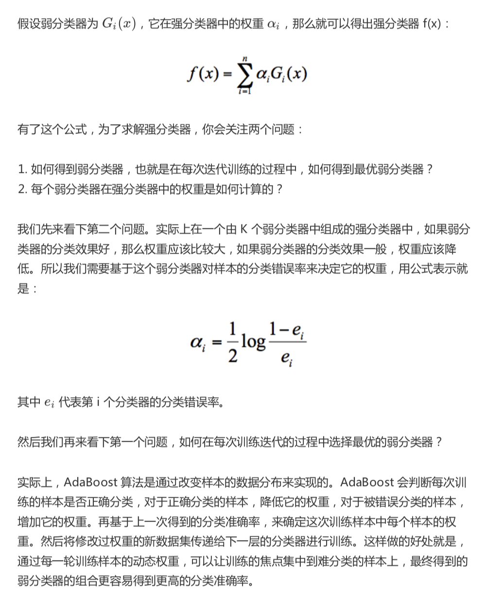
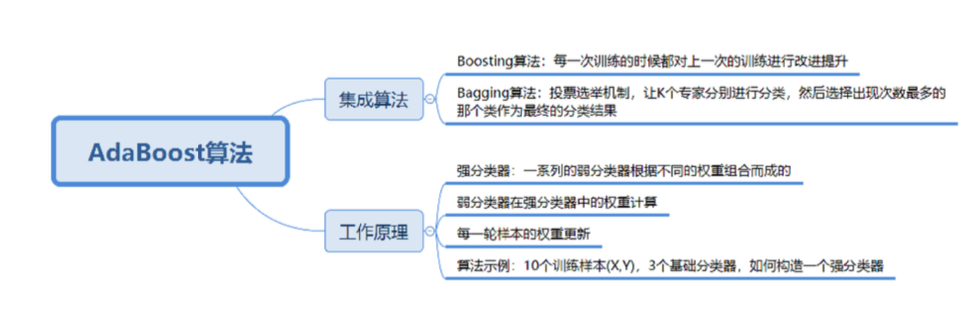

# 34-AdaBoost（上）：如何使用AdaBoost提升分类器性能？

AdaBoost 算法与随机森林算法一样都属于分类算法中的集成算法。

### AdaBoost 的工作原理

AdaBoost 全称 Adaptive Boosting， 中文含义是 自适应提升算法。

Boosting 算法， 是集成算法的一种，也是一类算法的总称。

这类算法通过训练多个弱分类器，将它们组合成一个强分类器，也就是俗话说的 "三个臭皮匠，顶个诸葛亮"。

### AdaBoost 算法示例

### 总结

