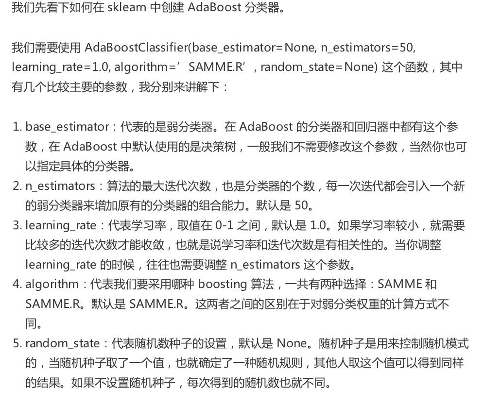
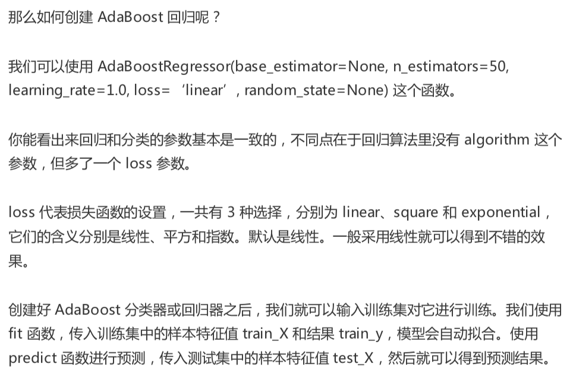
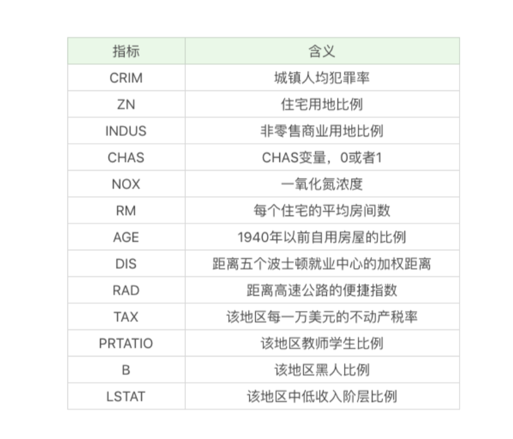
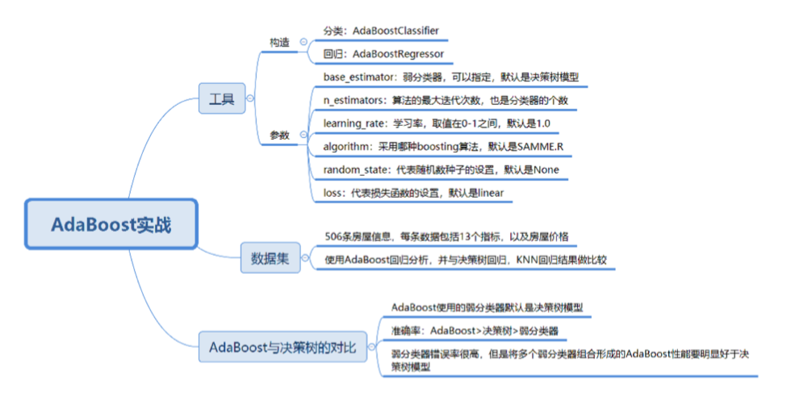

# 35-AdaBoost（下）如何使用AdaBoost对房价进行预测？


AdaBoost 不仅可以用于分类，还可以用于回归分析


### 如何使用 AdaBoost 工具

分类:

`from sklearn.ensemble import AdaBoostClassifier`


回归:

`from sklearn.ensemble import AdaBoostRegressor`








### 如何用 AdaBoost 对房价进行预测




```python
import numpy as np
import matplotlib.pyplot as plt
from sklearn import datasets
from sklearn.model_selection import train_test_split
from sklearn.metrics import mean_squared_error
from sklearn.metrics import zero_one_loss
from sklearn.datasets import load_boston
from sklearn.ensemble import AdaBoostRegressor
from sklearn.ensemble import AdaBoostClassifier
from sklearn.tree import DecisionTreeRegressor
from sklearn.tree import DecisionTreeClassifier
from sklearn.neighbors import KNeighborsRegressor

plt.rcParams['font.family'] = ['Arial Unicode MS'] #用来正常显示中文标签
plt.rcParams['axes.unicode_minus'] = False #用来正常显示负号

data = load_boston()
train_X, test_X, train_y, test_y = train_test_split(data.data, data.target, test_size=0.25, random_state=33)

# AdaBoost
regressor = AdaBoostRegressor()
regressor.fit(train_X, train_y)
pred_y = regressor.predict(test_X)
mse = mean_squared_error(test_y, pred_y)
print('房价预测结果：', pred_y)
print('均方误差：', round(mse, 2))

# 决策树
dec_regressor = DecisionTreeRegressor()
dec_regressor.fit(train_X, train_y)
pred = dec_regressor.predict(test_X)
mse = mean_squared_error(test_y, pred_y)
print('决策树军方误差：', round(mse, 2))

# KNN
knn_regressor = KNeighborsRegressor()
knn_regressor.fit(train_X, train_y)
pred_y = knn_regressor.predict(test_X)
mse = mean_squared_error(test_y, pred_y)
print('KNN均方误差：', round(mse, 2))


```


### AdaBoost 与决策树模型的比较


```python

import numpy as np
import matplotlib.pyplot as plt
from sklearn import datasets
from sklearn.model_selection import train_test_split
from sklearn.metrics import mean_squared_error
from sklearn.metrics import zero_one_loss
from sklearn.datasets import load_boston
from sklearn.ensemble import AdaBoostRegressor
from sklearn.ensemble import AdaBoostClassifier
from sklearn.tree import DecisionTreeRegressor
from sklearn.tree import DecisionTreeClassifier
from sklearn.neighbors import KNeighborsRegressor

X, y = datasets.make_hastie_10_2(n_samples=12000, random_state=1) # 生成二分类数据
test_X, test_y = X[:200], y[0:200]
train_X, train_y = X[2000:], y[2000:]

# 弱分类器
dt_stump = DecisionTreeClassifier(max_depth=1, min_samples_leaf=1)
dt_stump.fit(train_X, train_y)
dt_stump_err = 1.0 - dt_stump.score(test_X, test_y)
dt_stump_err

# 决策树分类器
dt = DecisionTreeClassifier()
dt.fit(train_X, train_y)
dt_err = 1.0 - dt.score(test_X, test_y)
dt_err

# AdaBoost分类器
ada = AdaBoostClassifier(base_estimator=dt_stump, n_estimators=200)
ada.fit(train_X, train_y)

fig = plt.figure(figsize=(16, 8))
ax = fig.add_subplot(111)
ax.plot([1, 200], [dt_stump_err]*2, 'k-', label='决策时弱分类器错误率')
ax.plot([1, 200], [dt_err]*2, 'k--', label='决策树模型错误率')
ada_err = np.zeros((200,))
for i, pred_y in enumerate(ada.staged_predict(test_X)):
    ada_err[i] = zero_one_loss(pred_y, test_y)
ax.plot(np.arange(200)+1, ada_err, label='AdaBoost错误率', color='orange')
ax.set_xlabel('迭代次数')
ax.set_ylabel('错误率')
leg = ax.legend(loc='upper right', fancybox=True)
plt.show()
```


### 总结

