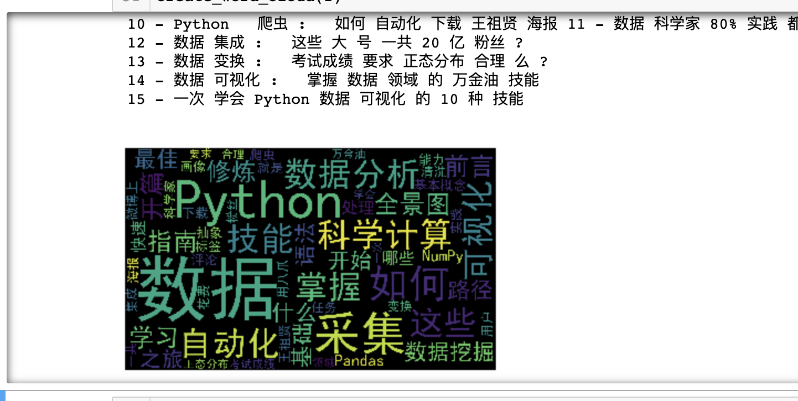
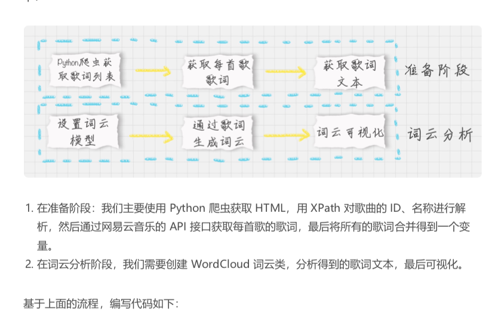

# 38-数据可视化实战：如何给毛不易的歌曲做词云展示？


目标

1. 掌握词云分析工具，并进行可视化呈现
2. 掌握 Python 爬虫，对网页的数据进行爬取
3. 掌握 XPath 工具, 分析提取想要的元素


### 如何制作词云

`pip install wordcloud`

```python
wc = WordCloud(
		font_path="./wc.ttf",
		max_words=100,
		width=2000,
		height=1200,
    )
```

可以使用 word cloud.tofile("a.jpg")， 将词云保存为格式

也可以使用 Matplotlib 进行显示

```python
import matplotlib.pyplot as plt
plt.imshow(wordcloud)
plt.axis("off")
plt.show()
```


```python
# -*- coding:utf-8 -*-

from wordcloud import WordCloud
import matplotlib.pyplot as plt
import jieba
from PIL import Image
import numpy as np

%matplotlib inline

# 生成词云
def create_word_cloud(f):
    print('根据词频，开始生成词云!')
#     f = remove_stop_words(f)
    cut_text = " ".join(jieba.cut(f,cut_all=False, HMM=True))
    wc = WordCloud(
        font_path="./SimHei.ttf",
        max_words=100,
        width=2000,
        height=1200,
    )
    print(cut_text)
    wordcloud = wc.generate(cut_text)
    # 写词云图片
    wordcloud.to_file("wordcloud.jpg")
    # 显示词云文件
    plt.imshow(wordcloud)
    plt.axis("off")
    plt.show()
    
f = """
前言
开篇
01-数据分析全景图及修炼指南
02-学习数据挖掘的最佳路径是什么?
03-Python基础语法:开始你的Python之旅
04-Python科学计算:用NumPy快速处理数据
05-Python科学计算:Pandas
06-学数据分析要掌握哪些基本概念?
07-用户画像: 标签化就是数据的抽象能力
08-数据采集:如何自动化采集数据?
09-数据采集: 如何用八爪鱼采集微博上的“D&G”评论
10-Python 爬虫: 如何自动化下载王祖贤海报\
11-数据科学家80%实践都花费在来这些清洗任务上?
12-数据集成: 这些大号一共20亿粉丝?
13-数据变换: 考试成绩要求正态分布合理么?
14-数据可视化: 掌握数据领域的万金油技能
15-一次学会Python数据可视化的10种技能
"""

create_word_cloud(f)
```





### 给毛不易的歌词制作词云




```python
# -*- coding:utf-8 -*-
# 网易云音乐 通过歌手ID，生成该歌手的词云
import requests
import sys
import re
import os
from wordcloud import WordCloud
import matplotlib.pyplot as plt
import jieba
from PIL import Image
import numpy as np
from lxml import etree

headers = {
		'Referer'	:'http://music.163.com',
		'Host'	 	:'music.163.com',
		'Accept' 	:'text/html,application/xhtml+xml,application/xml;q=0.9,image/webp,image/apng,*/*;q=0.8',
		'User-Agent':'Chrome/10'
	}

# 得到某一首歌的歌词
def get_song_lyric(headers, lyric_url):
	res = requests.request('GET', lyric_url, headers=headers)
	if 'lrc' in res.json():
		lyric = res.json()['lrc']['lyric']
		new_lyric = re.sub(r'[\d:.[\]]','',lyric)
		return new_lyric
	else:
		return ''
		print(res.json())

# 去掉停用词
def remove_stop_words(f):
	stop_words = ['作词', '作曲', '编曲', 'Arranger', '录音', '混音', '人声', 'Vocal', '弦乐', 'Keyboard', '键盘', '编辑', '助理', 'Assistants', 'Mixing', 'Editing', 'Recording', '音乐', '制作', 'Producer', '发行', 'produced', 'and', 'distributed']
	for stop_word in stop_words:
		f = f.replace(stop_word, '')
	return f

# 生成词云
def create_word_cloud(f):
	print('根据词频，开始生成词云!')
	f = remove_stop_words(f)
	cut_text = " ".join(jieba.cut(f,cut_all=False, HMM=True))
	wc = WordCloud(
		font_path="./wc.ttf",
		max_words=100,
		width=2000,
		height=1200,
    )
	print(cut_text)
	wordcloud = wc.generate(cut_text)
	# 写词云图片
	wordcloud.to_file("wordcloud.jpg")
	# 显示词云文件
	plt.imshow(wordcloud)
	plt.axis("off")
	plt.show()


# 得到指定歌手页面 热门前50的歌曲ID，歌曲名
def get_songs(artist_id):
	page_url = 'https://music.163.com/artist?id=' + artist_id
	# 获取网页HTML
	res = requests.request('GET', page_url, headers=headers)
	# 用XPath解析 前50首热门歌曲
	html = etree.HTML(res.text)
	href_xpath = "//*[@id='hotsong-list']//a/@href"
	name_xpath = "//*[@id='hotsong-list']//a/text()"
	hrefs = html.xpath(href_xpath)
	names = html.xpath(name_xpath)
	# 设置热门歌曲的ID，歌曲名称
	song_ids = []
	song_names = []
	for href, name in zip(hrefs, names):
		song_ids.append(href[9:])
		song_names.append(name)
		print(href, '  ', name)
	return song_ids, song_names

# 设置歌手ID，毛不易为12138269
artist_id = '12138269'
[song_ids, song_names] = get_songs(artist_id)

# 所有歌词
all_word = ''
# 获取每首歌歌词
for (song_id, song_name) in zip(song_ids, song_names):
	# 歌词API URL
	lyric_url = 'http://music.163.com/api/song/lyric?os=pc&id=' + song_id + '&lv=-1&kv=-1&tv=-1'
	lyric = get_song_lyric(headers, lyric_url)
	all_word = all_word + ' ' + lyric
	print(song_name)

#根据词频 生成词云
create_word_cloud(all_word)

```


