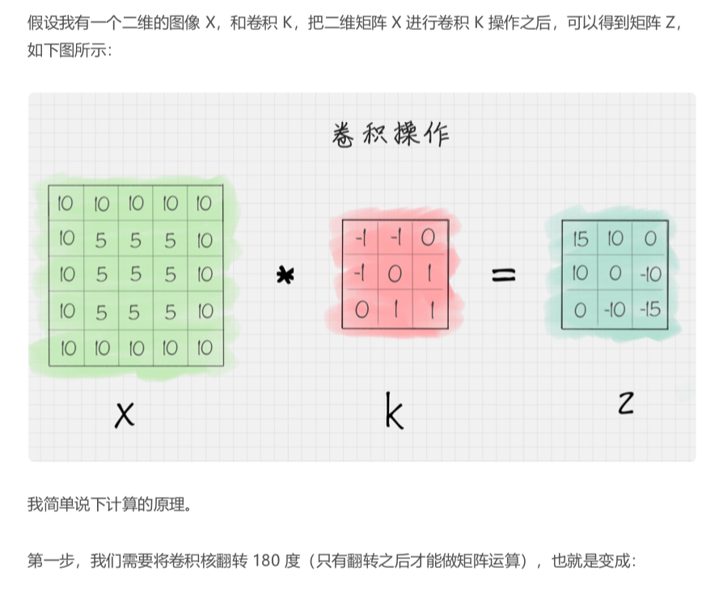
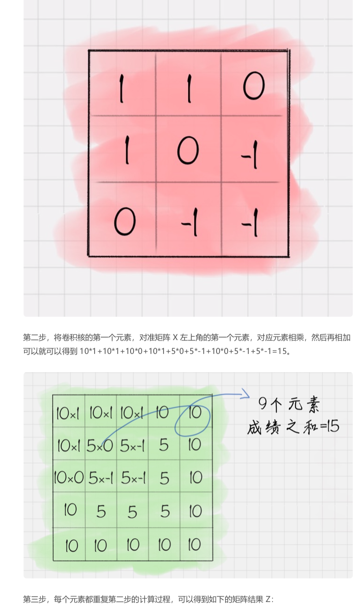
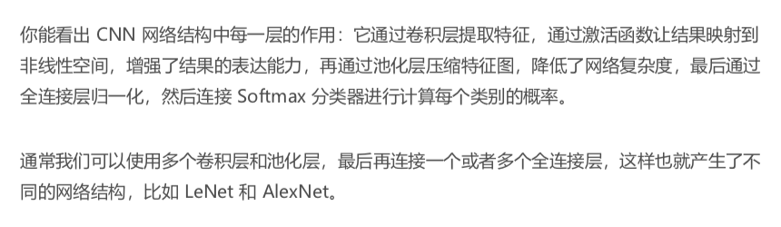
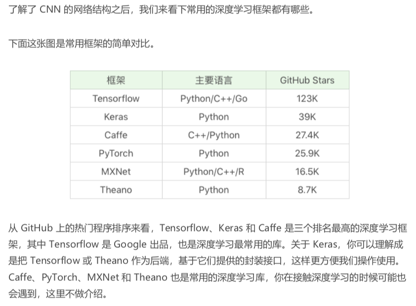
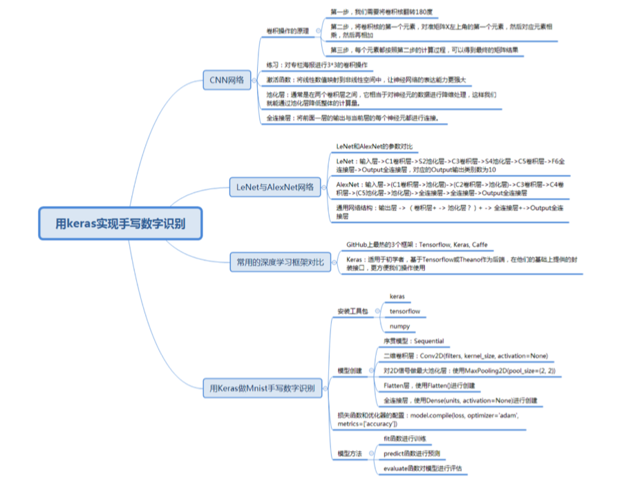

# 43-深度学习（下）：如何用Keras搭建深度学习网络做手写数字识别？


### 如何理解 CNN 网络中的卷积作用


CNN 网络结构由三层组成， 他们分别是 卷积层，池化层和全链接层。


卷积








```python

# coding=utf-8

import pylab
import numpy as np
from scipy import signal

# 设置原图像
img = np.array([[10, 10, 10, 10, 10],
                [10, 5, 5, 5, 10],
                [10, 5, 5, 5, 10],
                [10, 5, 5, 5, 10],
                [10, 10, 10, 10, 10]])
# 设置卷积核
fil = np.array([[-1, -1, 0],
                [-1, 0, 1],
                [0, 1, 1]])
# 对原图像进行卷积操作
res = signal.convolve2d(img, fil, mode='valid')
# 输出卷积后的结果
print(res)
```


对图像进行卷积

```python
# coding=utf-8
import matplotlib

matplotlib.use('Qt4Agg')
import matplotlib.pyplot as plt
import pylab
import cv2
import numpy as np
from scipy import signal

# 读取灰度图像
img = cv2.imread("haibao.jpeg", 0)
# 显示灰度图像
plt.imshow(img, cmap="gray")
pylab.show()
# 设置卷积核
fil = np.array(
  [
    [-1, -1, 0],
    [-1, 0, 1],
    [0, 1, 1]
  ]
)
# 卷积操作
res = signal.convolve2d(img, fil, mode='valid')
print(res)
# 显示卷积后的图片
plt.imshow(res, cmap="gray")
pylab.show()

```


CNN 的卷积层中可以有多个卷积核，以 LeNet 为例， 它的第一层卷积核有6 个， 因此可以帮我们提取出图像的6 个特征，从而有6个特征图.


**激活函数的作用**

做完卷积操作之后，通常还需要使用激活函数对图像进一步处理。Sigmoid 函数，在深度学习中有广泛的应用，还有 tanh, ReLU 等。

**池化层的作用**

池化层通常在两个卷积之间，它的作用相当于对神经元的数据做降维处理，这样就能降低整体的计算量。

**全连接层的作用**

全链接层将前面一层的输出结果于当前层的每个神经元都进行了连接。


这样就可以把前面计算出来的所有特征，通过全链接层将输出值送给分类器。


### LeNet 和 AlexNet 网络




### 常用的深度学习框架对比




### 用 Keras 做 Mnist 手写数字识别


```python

# coding=utf-8
# 使用 LeNet 模型对 Mnist 手写数字进行识别
import keras
from keras.datasets import mnist
from keras.layers import Conv2D, MaxPooling2D
from keras.layers import Dense, Flatten
from keras.models import Sequential

# 数据加载
(train_x, train_y), (test_x, test_y) = mnist.load_data()
# 输入数据为 mnist 数据集
train_x = train_x.reshape(train_x.shape[0], 28, 28, 1)
test_x = test_x.reshape(test_x.shape[0], 28, 28, 1)
train_x = train_x / 255
test_x = test_x / 255
train_y = keras.utils.to_categorical(train_y, 10)
test_y = keras.utils.to_categorical(test_y, 10)
# 创建序贯模型
model = Sequential()
# 第一层卷积层：6 个卷积核，大小为 5∗5, relu 激活函数
model.add(Conv2D(6, kernel_size=(5, 5), activation='relu', input_shape=(28, 28, 1)))
# 第二层池化层：最大池化
model.add(MaxPooling2D(pool_size=(2, 2)))
# 第三层卷积层：16 个卷积核，大小为 5*5，relu 激活函数
model.add(Conv2D(16, kernel_size=(5, 5), activation='relu'))
# 第二层池化层：最大池化
model.add(MaxPooling2D(pool_size=(2, 2)))
# 将参数进行扁平化，在 LeNet5 中称之为卷积层，实际上这一层是一维向量，和全连接层一样
model.add(Flatten())
model.add(Dense(120, activation='relu'))
# 全连接层，输出节点个数为 84 个
model.add(Dense(84, activation='relu'))
# 输出层 用 softmax 激活函数计算分类概率
model.add(Dense(10, activation='softmax'))
# 设置损失函数和优化器配置
model.compile(loss=keras.metrics.categorical_crossentropy, optimizer=keras.optimizers.Adam(), metrics=['accuracy'])
# 传入训练数据进行训练
model.fit(train_x, train_y, batch_size=128, epochs=2, verbose=1, validation_data=(test_x, test_y))
# 对结果进行评估
score = model.evaluate(test_x, test_y)
print('误差:%0.4lf' % score[0])
print('准确率:', score[1])
```


### 总结


