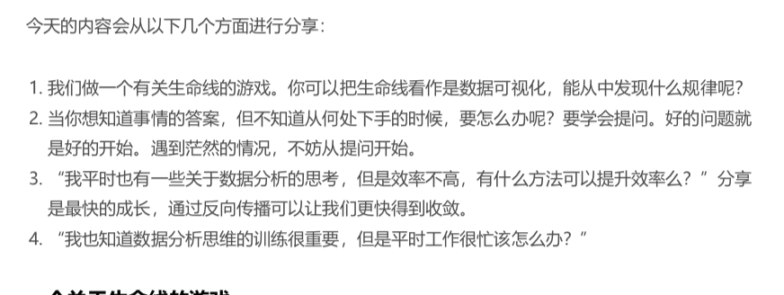
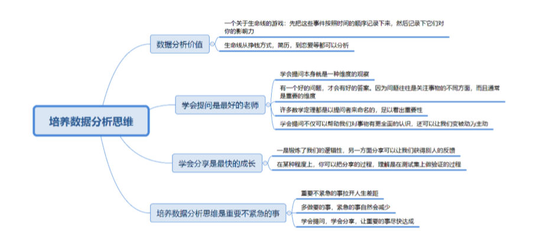

# 44-如何培养你的数据分析思维？

### 一个关于生命线的游戏

通过历史才能看到未来，如果我们不去分析这些历史，就没有办法找到未来的规律。大到国家，小到个人，都是如此。这也是为什么很多成功人士经常读书的原因之一吧。通过总结别人的成功或者失败的经验，可以启迪自己的人生道路。

### 提问是最好的老师

实际上提问本身就是一种唯独的观察。很多人在做数据分析的时候，首先遇到的问题是没有数据怎么办？数据从哪里来？比如说，你想观察自己挣钱模式的规律，或者解决个人的情感问题，在或者，想找一份适合自己的工作等。我们**首先需要定义一个目标**

然后围绕这个目标在问自己, **这些数据可能会在哪里**？是通过分析自己过去的经历找，还是从网上找相关信息？都有哪些渠道可以收集到这些信息？有一个好问题，才会有好的答案。问题可以帮助我们关注事物的不同方面，而且通常是一些重要的围堵，对我们全面客观的分析一件事情非常有好处。

### 学会分享是最快的成长

如果说培养数据思维从提问开始，那么吧总结分享作为结束则最合适不过。

### 培养数据分析思维是重要不紧急的事

你可能会说，“道理我都懂，可就是做的时候想不起来。”那是怎么回事呢？实际上，培养数据分析思维是重要不紧急的事。在工作中，我们经常会被紧急的事情占据带宽。这些紧急的事情对当下很重要，但是放长远来看重要性就很弱了。而拉开我们人生差距的，恰恰是那些重要不紧急的事情傻姑娘，而不是在于我们每天处理了多少紧急的事。

这点很容易立即，毕竟人都有惰性，紧急的事情来了一般都会优先处理。不过你要换一种思考方式，既然我们人生的差距不是在于做过多少紧急的事，而是在于做过多少重要的事，那么从工作的第一天开始，我就应该着重积累重要的事，即使它目前并不紧急。

### 总结

